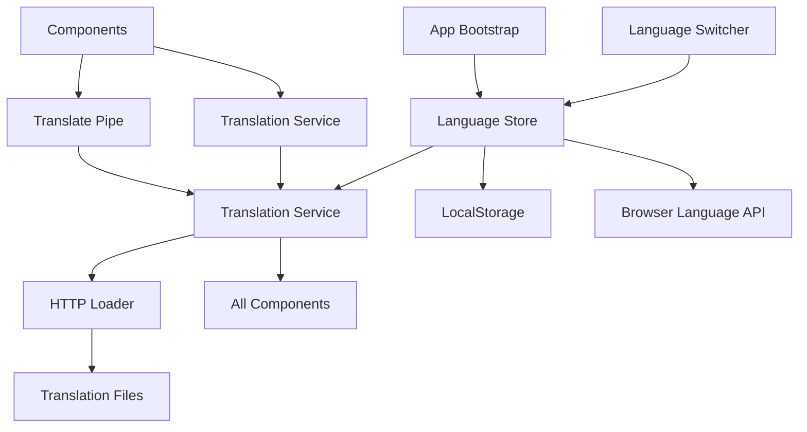
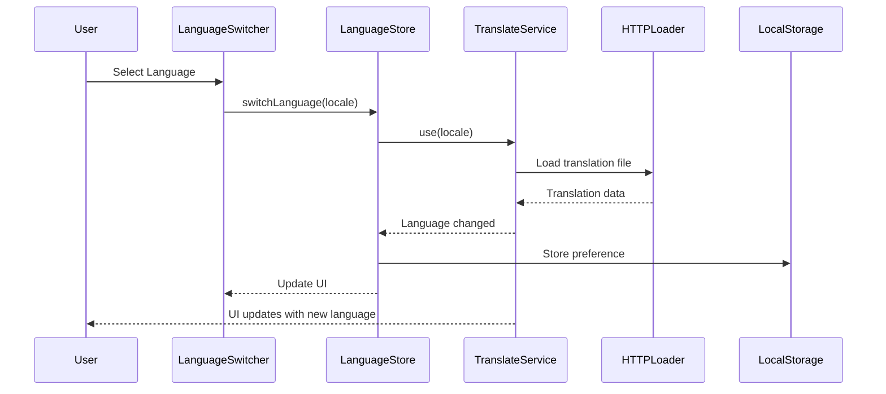

# Design Document: Internationalization (i18n)

## Overview

This design implements a runtime internationalization system for an Angular 21.1.4 application using ngx-translate for translation management and @ngrx/signals for global state management. The system supports dynamic language switching without page reloads, browser language detection, and persistent language preferences.

The architecture follows the existing application patterns:
- Standalone components with functional providers
- Signal stores with `providedIn: 'root'` for state management
- PrimeNG UI components for the language switcher
- HTTP-based translation file loading

## Architecture

### High-Level Architecture



### Component Interaction Flow



## Components and Interfaces

### 1. Language Store (Signal Store)

The Language Store manages global language state using @ngrx/signals pattern.

**File:** `src/app/core/stores/language.store.ts`

```typescript
interface LanguageState {
  currentLanguage: string;
  availableLanguages: Language[];
  isLoading: boolean;
  error: string | null;
}

interface Language {
  code: string;
  name: string;
  nativeName: string;
}

const LanguageStore = signalStore(
  { providedIn: 'root' },
  withState<LanguageState>({
    currentLanguage: 'en',
    availableLanguages: [
      { code: 'en', name: 'English', nativeName: 'English' },
      { code: 'es', name: 'Spanish', nativeName: 'Español' }
    ],
    isLoading: false,
    error: null
  }),
  withComputed((state) => ({
    currentLanguageObject: computed(() => 
      state.availableLanguages().find(lang => lang.code === state.currentLanguage())
    )
  })),
  withMethods((store, translateService = inject(TranslateService)) => ({
    initializeLanguage: rxMethod<void>(
      pipe(
        switchMap(() => {
          const storedLang = localStorage.getItem('language-preference');
          const browserLang = translateService.getBrowserLang();
          const supportedLangs = store.availableLanguages().map(l => l.code);
          
          let initialLang = 'en';
          if (storedLang && supportedLangs.includes(storedLang)) {
            initialLang = storedLang;
          } else if (browserLang && supportedLangs.includes(browserLang)) {
            initialLang = browserLang;
          }
          
          return from(translateService.use(initialLang)).pipe(
            tap(() => {
              patchState(store, { currentLanguage: initialLang, isLoading: false });
            }),
            catchError((error) => {
              patchState(store, { error: error.message, isLoading: false });
              return of(null);
            })
          );
        })
      )
    ),
    
    switchLanguage: rxMethod<string>(
      pipe(
        tap(() => patchState(store, { isLoading: true, error: null })),
        switchMap((locale) => {
          const supportedLangs = store.availableLanguages().map(l => l.code);
          if (!supportedLangs.includes(locale)) {
            patchState(store, { 
              error: `Unsupported language: ${locale}`, 
              isLoading: false 
            });
            return of(null);
          }
          
          return from(translateService.use(locale)).pipe(
            tap(() => {
              localStorage.setItem('language-preference', locale);
              patchState(store, { 
                currentLanguage: locale, 
                isLoading: false 
              });
            }),
            catchError((error) => {
              patchState(store, { 
                error: error.message, 
                isLoading: false 
              });
              return of(null);
            })
          );
        })
      )
    )
  })),
  withHooks({
    onInit(store) {
      store.initializeLanguage();
    }
  })
);
```

### 2. Translation Service Configuration

**File:** `src/app/app.config.ts`

```typescript
export function HttpLoaderFactory(http: HttpClient) {
  return new TranslateHttpLoader(http, './assets/i18n/', '.json');
}

export const appConfig: ApplicationConfig = {
  providers: [
    provideRouter(routes),
    provideHttpClient(),
    providePrimeNG(),
    provideTranslateService({
      defaultLanguage: 'en',
      loader: {
        provide: TranslateLoader,
        useFactory: HttpLoaderFactory,
        deps: [HttpClient]
      }
    })
  ]
};
```

### 3. Language Switcher Component

**File:** `src/app/shared/components/language-switcher/language-switcher.component.ts`

```typescript
@Component({
  selector: 'app-language-switcher',
  standalone: true,
  imports: [DropdownModule, CommonModule],
  template: `
    <p-dropdown
      [options]="availableLanguages()"
      [(ngModel)]="selectedLanguage"
      (onChange)="onLanguageChange($event)"
      optionLabel="nativeName"
      optionValue="code"
      [style]="{ width: '150px' }"
      placeholder="Select Language"
    />
  `
})
export class LanguageSwitcherComponent {
  private languageStore = inject(LanguageStore);
  
  availableLanguages = this.languageStore.availableLanguages;
  selectedLanguage = this.languageStore.currentLanguage;
  
  onLanguageChange(event: DropdownChangeEvent): void {
    this.languageStore.switchLanguage(event.value);
  }
}
```

### 4. Translation Pipe Usage

Components use the translate pipe for static text:

```typescript
@Component({
  selector: 'app-login',
  standalone: true,
  imports: [TranslateModule],
  template: `
    <h1>{{ 'auth.login.title' | translate }}</h1>
    <button>{{ 'auth.login.submit' | translate }}</button>
  `
})
export class LoginComponent {}
```

### 5. Translation Service Usage

For dynamic translations in component logic:

```typescript
@Component({
  selector: 'app-user-profile',
  standalone: true,
  imports: [TranslateModule]
})
export class UserProfileComponent {
  private translate = inject(TranslateService);
  private messageService = inject(MessageService);
  
  saveProfile(): void {
    // Async translation
    this.translate.get('profile.save.success').subscribe(message => {
      this.messageService.add({ severity: 'success', summary: message });
    });
    
    // Synchronous translation (when translations are already loaded)
    const errorMsg = this.translate.instant('profile.save.error');
  }
}
```

## Data Models

### Language Interface

```typescript
interface Language {
  code: string;           // ISO 639-1 language code (e.g., 'en', 'es')
  name: string;           // English name of the language
  nativeName: string;     // Native name of the language
}
```

### Language State Interface

```typescript
interface LanguageState {
  currentLanguage: string;        // Currently active language code
  availableLanguages: Language[]; // List of supported languages
  isLoading: boolean;             // Loading state during language switch
  error: string | null;           // Error message if language operation fails
}
```

### Translation File Structure

**File:** `src/assets/i18n/en.json`

```json
{
  "common": {
    "save": "Save",
    "cancel": "Cancel",
    "delete": "Delete",
    "edit": "Edit",
    "close": "Close",
    "confirm": "Confirm",
    "loading": "Loading..."
  },
  "nav": {
    "home": "Home",
    "dashboard": "Dashboard",
    "profile": "Profile",
    "settings": "Settings",
    "logout": "Logout"
  },
  "auth": {
    "login": {
      "title": "Login",
      "email": "Email",
      "password": "Password",
      "submit": "Sign In",
      "forgotPassword": "Forgot Password?",
      "errors": {
        "invalidCredentials": "Invalid email or password",
        "required": "This field is required"
      }
    },
    "register": {
      "title": "Register",
      "confirmPassword": "Confirm Password",
      "submit": "Create Account"
    }
  },
  "validation": {
    "required": "{{field}} is required",
    "email": "Please enter a valid email",
    "minLength": "Minimum length is {{min}} characters",
    "maxLength": "Maximum length is {{max}} characters"
  },
  "messages": {
    "success": {
      "saved": "Changes saved successfully",
      "deleted": "Item deleted successfully",
      "created": "Item created successfully"
    },
    "errors": {
      "generic": "An error occurred. Please try again.",
      "network": "Network error. Please check your connection."
    }
  }
}
```

**File:** `src/assets/i18n/es.json`

```json
{
  "common": {
    "save": "Guardar",
    "cancel": "Cancelar",
    "delete": "Eliminar",
    "edit": "Editar",
    "close": "Cerrar",
    "confirm": "Confirmar",
    "loading": "Cargando..."
  },
  "nav": {
    "home": "Inicio",
    "dashboard": "Panel",
    "profile": "Perfil",
    "settings": "Configuración",
    "logout": "Cerrar Sesión"
  },
  "auth": {
    "login": {
      "title": "Iniciar Sesión",
      "email": "Correo Electrónico",
      "password": "Contraseña",
      "submit": "Entrar",
      "forgotPassword": "¿Olvidaste tu Contraseña?",
      "errors": {
        "invalidCredentials": "Correo o contraseña inválidos",
        "required": "Este campo es obligatorio"
      }
    },
    "register": {
      "title": "Registrarse",
      "confirmPassword": "Confirmar Contraseña",
      "submit": "Crear Cuenta"
    }
  },
  "validation": {
    "required": "{{field}} es obligatorio",
    "email": "Por favor ingrese un correo válido",
    "minLength": "La longitud mínima es {{min}} caracteres",
    "maxLength": "La longitud máxima es {{max}} caracteres"
  },
  "messages": {
    "success": {
      "saved": "Cambios guardados exitosamente",
      "deleted": "Elemento eliminado exitosamente",
      "created": "Elemento creado exitosamente"
    },
    "errors": {
      "generic": "Ocurrió un error. Por favor intente nuevamente.",
      "network": "Error de red. Por favor verifique su conexión."
    }
  }
}
```


## Correctness Properties

*A property is a characteristic or behavior that should hold true across all valid executions of a system—essentially, a formal statement about what the system should do. Properties serve as the bridge between human-readable specifications and machine-verifiable correctness guarantees.*

### Property Reflection

After analyzing all acceptance criteria, I identified the following redundancies:
- Criteria 2.3 is redundant with 2.1 (component notification is implicit in translation updates)
- Criteria 4.1, 4.2, 4.3, 4.4 are redundant with 3.4, 3.5, 3.3 (browser language detection and priority)
- Criterion 5.6 is redundant (integration is verified through functional tests)

The following properties provide unique validation value:

### Property 1: Translation File Loading for All Locales
*For any* supported language in the availableLanguages list, when the application initializes, the i18n_System should make an HTTP request to load the translation file at `./assets/i18n/{locale}.json`.

**Validates: Requirements 1.3, 1.4**

### Property 2: Missing Key Fallback
*For any* translation key that exists in English but not in the current non-English language, the i18n_System should return the English translation.

**Validates: Requirements 1.5**

### Property 3: Language Switch Updates UI Without Reload
*For any* translation key currently displayed in the UI, when the language is switched, the displayed text should update to the new language without triggering a page navigation or reload.

**Validates: Requirements 2.1**

### Property 4: Language Switch Updates Store State
*For any* valid language code, when switchLanguage is called with that code, the Language_Store's currentLanguage signal should update to reflect the new language.

**Validates: Requirements 2.2**

### Property 5: Language Switch Error Handling
*For any* error condition during language switching (network failure, missing file), the i18n_System should maintain the current language value and set an error state.

**Validates: Requirements 2.5**

### Property 6: Language Preference Persistence
*For any* language selection made by the user, the i18n_System should store that language code in localStorage under the key 'language-preference'.

**Validates: Requirements 3.1**

### Property 7: Stored Preference Retrieval
*For any* language code stored in localStorage under 'language-preference', when the application initializes, the i18n_System should use that language as the initial language.

**Validates: Requirements 3.2, 3.3**

### Property 8: Browser Language Detection Fallback
*For any* initialization where no stored preference exists, the i18n_System should detect the browser language and use it if supported, otherwise default to English.

**Validates: Requirements 3.4, 3.5**

### Property 9: Signal Reactivity
*For any* change to the Language_Store's currentLanguage signal, all computed signals and components that depend on it should receive the updated value.

**Validates: Requirements 5.5**

### Property 10: Language Switcher Displays All Languages
*For any* language in the availableLanguages list, the Language_Switcher component should display that language as an option in the dropdown.

**Validates: Requirements 6.1**

### Property 11: Language Switcher Reflects Current Language
*For any* value of currentLanguage in the Language_Store, the Language_Switcher's selected value should match that language code.

**Validates: Requirements 6.2**

### Property 12: Language Switcher Triggers Change
*For any* language option in the Language_Switcher, when a user selects that option, the component should call the Language_Store's switchLanguage method with the corresponding language code.

**Validates: Requirements 6.3**

### Property 13: Native Language Names Display
*For any* language in the Language_Switcher dropdown, the displayed text should be the language's nativeName property (e.g., "Español" for Spanish, not "Spanish").

**Validates: Requirements 6.5**

### Property 14: Translation File Structure Consistency
*For any* two translation files (e.g., en.json and es.json), both files should contain the exact same set of translation keys (though with different values).

**Validates: Requirements 8.5**

### Property 15: Nested Key Access
*For any* nested translation key using dot notation (e.g., "auth.login.title"), the i18n_System should correctly retrieve the nested value from the translation file.

**Validates: Requirements 8.3**

### Property 16: Parameter Interpolation
*For any* translation key containing interpolation parameters (e.g., "{{field}} is required"), when provided with parameter values, the i18n_System should replace the placeholders with the actual values.

**Validates: Requirements 8.4**

### Property 17: Missing Key Display
*For any* translation key that does not exist in any translation file, the i18n_System should display the key itself as the fallback text.

**Validates: Requirements 10.1**

### Property 18: Translation Load Failure Handling
*For any* HTTP error when loading a translation file, the i18n_System should log an error to the console and continue operating with previously loaded translations or defaults.

**Validates: Requirements 10.2, 10.4**

### Property 19: Invalid Language Rejection
*For any* language code that is not in the availableLanguages list, when switchLanguage is called with that code, the i18n_System should reject the change, maintain the current language, and set an error state.

**Validates: Requirements 10.5**

## Error Handling

### Translation Loading Errors

**Scenario:** HTTP request for translation file fails (404, 500, network error)

**Handling:**
1. Catch error in Language Store's rxMethod
2. Log error to console with descriptive message
3. Set error state in store: `patchState(store, { error: error.message })`
4. Maintain current language (do not change currentLanguage)
5. Use previously loaded translations if available
6. Fall back to default language (English) if no translations loaded

**Implementation:**
```typescript
catchError((error) => {
  console.error(`Failed to load translations for ${locale}:`, error);
  patchState(store, { 
    error: `Translation load failed: ${error.message}`, 
    isLoading: false 
  });
  return of(null);
})
```

### Missing Translation Keys

**Scenario:** Component requests a translation key that doesn't exist

**Handling:**
1. ngx-translate returns the key itself as fallback
2. No error thrown (graceful degradation)
3. Console warning in development mode
4. If key exists in default language (English), use that value

**Configuration:**
```typescript
provideTranslateService({
  defaultLanguage: 'en',
  useDefaultLang: true  // Fall back to default language for missing keys
})
```

### Invalid Language Code

**Scenario:** User or code attempts to switch to unsupported language

**Handling:**
1. Validate language code against availableLanguages list
2. Reject switch if invalid
3. Set error state with descriptive message
4. Maintain current language
5. Log warning to console

**Implementation:**
```typescript
const supportedLangs = store.availableLanguages().map(l => l.code);
if (!supportedLangs.includes(locale)) {
  console.warn(`Attempted to switch to unsupported language: ${locale}`);
  patchState(store, { 
    error: `Unsupported language: ${locale}`, 
    isLoading: false 
  });
  return of(null);
}
```

### Interpolation Errors

**Scenario:** Translation with parameters is called without required parameters

**Handling:**
1. ngx-translate displays raw translation string with placeholder syntax
2. No error thrown
3. Example: "{{field}} is required" displays as-is if no params provided

**Best Practice:**
```typescript
// Always provide parameters for parameterized translations
this.translate.get('validation.required', { field: 'Email' }).subscribe(msg => {
  // msg = "Email is required"
});
```

### LocalStorage Errors

**Scenario:** LocalStorage is unavailable or quota exceeded

**Handling:**
1. Wrap localStorage operations in try-catch
2. If storage fails, continue without persistence
3. Log warning to console
4. System continues to function (language changes work, just not persisted)

**Implementation:**
```typescript
try {
  localStorage.setItem('language-preference', locale);
} catch (error) {
  console.warn('Failed to persist language preference:', error);
  // Continue without persistence
}
```

## Testing Strategy

### Dual Testing Approach

This feature requires both unit tests and property-based tests for comprehensive coverage:

**Unit Tests** focus on:
- Specific examples of language switching (English → Spanish)
- Edge cases (unsupported language codes, missing translation files)
- Error conditions (network failures, localStorage unavailable)
- Component integration (Language Switcher interaction with store)
- Specific translation key lookups

**Property-Based Tests** focus on:
- Universal properties across all supported languages
- Translation file structure consistency
- Signal reactivity for any language change
- Parameter interpolation for any valid parameters
- Fallback behavior for any missing keys

### Property-Based Testing Configuration

**Library:** Use `@fast-check/vitest` for property-based testing in Angular/Vitest environment

**Configuration:**
- Minimum 100 iterations per property test
- Each test tagged with feature name and property number
- Tag format: `// Feature: internationalization, Property {N}: {property text}`

**Example Property Test:**
```typescript
import { fc, test } from '@fast-check/vitest';

// Feature: internationalization, Property 6: Language Preference Persistence
test.prop([fc.constantFrom('en', 'es')])(
  'should persist any selected language to localStorage',
  (locale) => {
    const store = TestBed.inject(LanguageStore);
    store.switchLanguage(locale);
    
    const stored = localStorage.getItem('language-preference');
    expect(stored).toBe(locale);
  }
);
```

### Unit Testing Strategy

**Test Files:**
- `language.store.spec.ts` - Language Store state management
- `language-switcher.component.spec.ts` - Language Switcher UI component
- `translation.service.spec.ts` - Translation Service integration
- `translation-files.spec.ts` - Translation file structure validation

**Key Test Scenarios:**

1. **Language Store Initialization**
   - Default to English when no preference or browser language
   - Use stored preference when available
   - Use browser language when no preference exists
   - Handle unsupported browser languages

2. **Language Switching**
   - Switch from English to Spanish
   - Switch from Spanish to English
   - Reject invalid language codes
   - Handle network errors during switch

3. **Translation Retrieval**
   - Get existing translation keys
   - Handle missing translation keys
   - Interpolate parameters correctly
   - Fall back to English for missing keys in other languages

4. **Language Switcher Component**
   - Display all available languages
   - Show current language as selected
   - Trigger language change on selection
   - Update UI when store changes

5. **Persistence**
   - Save language preference to localStorage
   - Retrieve language preference on init
   - Handle localStorage errors gracefully

### Integration Testing

**End-to-End Scenarios:**
1. First-time user with English browser → sees English UI
2. First-time user with Spanish browser → sees Spanish UI
3. User switches language → UI updates immediately
4. User refreshes page → language preference persists
5. User with unsupported browser language → defaults to English

### Translation File Validation

**Automated Checks:**
- All language files have identical key structures
- No missing keys between language files
- All parameterized translations use consistent parameter names
- JSON files are valid and parseable

**Implementation:**
```typescript
describe('Translation Files', () => {
  it('should have identical keys across all languages', () => {
    const enKeys = Object.keys(flattenObject(enTranslations));
    const esKeys = Object.keys(flattenObject(esTranslations));
    
    expect(enKeys.sort()).toEqual(esKeys.sort());
  });
});
```

### Testing Tools

- **Vitest:** Unit test runner
- **@fast-check/vitest:** Property-based testing
- **@angular/core/testing:** Angular testing utilities
- **TestBed:** Angular dependency injection for tests
- **MockBuilder:** For component testing with dependencies

### Test Coverage Goals

- **Line Coverage:** Minimum 80%
- **Branch Coverage:** Minimum 75%
- **Property Tests:** All 19 correctness properties implemented
- **Unit Tests:** All critical paths and edge cases covered
